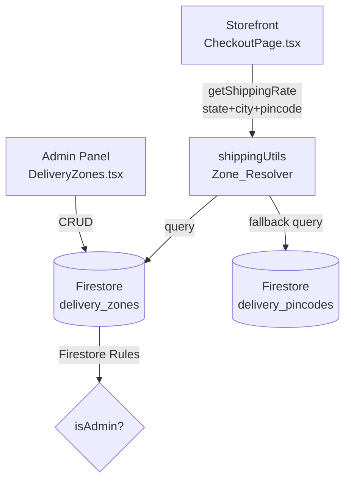
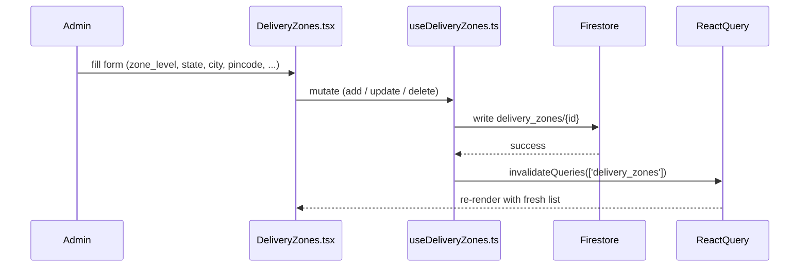
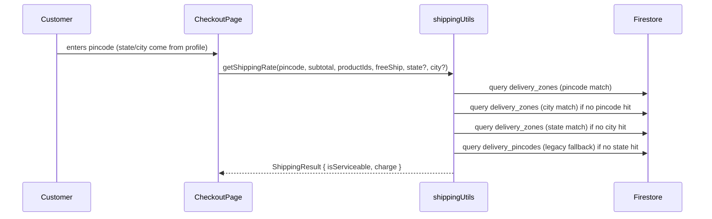

# Design Document — Hierarchical Delivery Zones

## Overview

This feature replaces Festecart's flat pincode-based delivery validation with a three-level hierarchical zone model: **State → City → Pincode**. Admins can create a Delivery_Zone at any of the three granularities. At checkout the storefront resolves the most specific matching active zone and uses its `shipping_charge`. Existing `delivery_pincodes` records remain the last-resort fallback so no data migration is needed.

The implementation touches five artifacts:

| File | Change |
|---|---|
| `src/types/index.ts` | Add `ZoneLevel` type and `DeliveryZone` interface |
| `src/hooks/useDeliveryZones.ts` | Replace current shipping-zone hook with hierarchical CRUD |
| `src/pages/DeliveryZones.tsx` | Replace with new hierarchical management UI |
| `firestore.rules` | Confirm/update `delivery_zones` rule |
| `scripts/CheckoutPage.tsx` | Pass `state` + `city` to `getShippingRate` / `getUndeliverableProductIds` |

---

## Architecture

### High-level flow



### Zone Resolution Priority

```
1. Active Pincode_Zone  (pincode + city + state all match)
2. Active City_Zone     (city + state match)
3. Active State_Zone    (state matches)
4. Active Legacy_Pincode (delivery_pincodes, pincode matches)
5. Not serviceable
```

### Data flow — admin panel



### Data flow — storefront checkout



---

## Components and Interfaces

### 1. `ZoneLevel` type and `DeliveryZone` interface (`src/types/index.ts`)

```typescript
export type ZoneLevel = 'state' | 'city' | 'pincode'

export interface DeliveryZone {
  id:              string
  zone_level:      ZoneLevel
  state:           string          // always set
  city:            string          // '' for State_Zone
  pincode:         string          // '' for State_Zone and City_Zone
  area_name:       string
  shipping_charge: number          // >= 0, INR
  is_active:       boolean
  created_at:      string          // Firestore Timestamp → serialised string
  updated_at:      string
}
```

### 2. `useDeliveryZones` hook (`src/hooks/useDeliveryZones.ts`)

```typescript
// Public surface — types
export type { ZoneLevel }
export type { DeliveryZone }

export type AddDeliveryZonePayload = Omit<DeliveryZone, 'id' | 'created_at' | 'updated_at'>
export type UpdateDeliveryZonePayload = Pick<DeliveryZone, 'id' | 'area_name' | 'shipping_charge' | 'is_active'>

// Hooks
export function useDeliveryZones(): UseQueryResult<DeliveryZone[]>
export function useAddDeliveryZone(): UseMutationResult<void, Error, AddDeliveryZonePayload>
export function useUpdateDeliveryZone(): UseMutationResult<void, Error, UpdateDeliveryZonePayload>
export function useDeleteDeliveryZone(): UseMutationResult<void, Error, string>
```

Key implementation notes:
- `useDeliveryZones` orders by `created_at desc`.
- Add mutation stamps `created_at` and `updated_at` with `Timestamp.now()`.
- Update mutation only patches `area_name`, `shipping_charge`, `is_active`, `updated_at` — zone_level, state, city, pincode are immutable after creation.
- All mutations call `qc.invalidateQueries({ queryKey: ['delivery_zones'] })` on success.
- The hook re-exports `ZonePlaceType` and `ZonePlace` are **removed** from this file; those belonged to the old shipping-zone data model and are no longer relevant.

### 3. `DeliveryZones.tsx` page (`src/pages/DeliveryZones.tsx`)

The page handles two views mounted under the same file (matching the existing route pattern in `App.tsx`):

| Route | View |
|---|---|
| `/delivery-zones` | Zone list + inline add/edit panel |
| `/delivery-zones/add` | Zone creation form (or inline panel) |
| `/delivery-zones/:zoneId/edit` | Zone edit form |

**Sub-components:**

```
DeliveryZones (page root)
├── ZoneForm           — add / edit form (zone_level radio, conditional inputs, save button)
├── ZoneTable          — sortable table with search bar
│   └── ZoneRow        — single row with badges, actions (edit / delete)
└── DeleteConfirm      — inline confirmation prompt
```

**ZoneForm props:**

```typescript
interface ZoneFormProps {
  initial?: DeliveryZone        // undefined → add mode, defined → edit mode
  onSaved: () => void
  onCancel: () => void
}
```

Form field visibility rules:

| `zone_level` | `state` | `city` | `pincode` |
|---|---|---|---|
| `state` | shown, required | hidden | hidden |
| `city` | shown, required | shown, required | hidden |
| `pincode` | shown, required | shown, required | shown, required |

In **edit mode**: `zone_level`, `state`, `city`, `pincode` fields are rendered as read-only text (disabled inputs or plain `<p>` tags). Only `area_name`, `shipping_charge`, and `is_active` are editable.

**ZoneTable search** filters client-side against `state`, `city`, `pincode`, and `area_name` (case-insensitive `includes` check).

**Zone Level badge** colours:
- `state` → blue
- `city` → amber
- `pincode` → green

### 4. `getShippingRate` upgrade (`scripts/CheckoutPage.tsx` + `shippingUtils`)

The existing call signature is:

```typescript
getShippingRate(pincode: string, subtotal: number, productIds: string[], freeShip: boolean)
```

The upgraded signature accepts optional `state` and `city` while remaining backward-compatible:

```typescript
getShippingRate(
  pincode:    string,
  subtotal:   number,
  productIds: string[],
  freeShip:   boolean,
  state?:     string,
  city?:      string
): Promise<ShippingResult>
```

`CheckoutPage.tsx` derives `state` and `city` from the logged-in user's profile or the guest form and passes them through:

```typescript
const profileState = user ? (profile?.state ?? '') : guestForm.state
const profileCity  = user ? (profile?.city  ?? '') : guestForm.city

getShippingRate(p, subtotal, cartProductIds, freeShip, profileState, profileCity)
```

### 5. Firestore rules — `delivery_zones` collection

The rules already contain the correct entry (confirmed in `firestore.rules`):

```
match /delivery_zones/{id} {
  allow read:  if true;
  allow write: if isAdmin();
}
```

`isAdmin()` returns `true` for both `super_admin` and `admin` roles, satisfying Requirement 9. No change needed.

---

## Data Models

### `delivery_zones` Firestore document

```json
{
  "zone_level":      "pincode",
  "state":           "Karnataka",
  "city":            "Bengaluru",
  "pincode":         "560001",
  "area_name":       "MG Road",
  "shipping_charge": 50,
  "is_active":       true,
  "created_at":      "<Timestamp>",
  "updated_at":      "<Timestamp>"
}
```

Field constraints:

| Field | Type | Constraints |
|---|---|---|
| `zone_level` | string | `"state"` \| `"city"` \| `"pincode"` |
| `state` | string | non-empty for all levels |
| `city` | string | non-empty for `city`/`pincode` levels; `""` for `state` level |
| `pincode` | string | matches `^\d{6}$` for `pincode` level; `""` otherwise |
| `area_name` | string | optional label |
| `shipping_charge` | number | `>= 0` |
| `is_active` | boolean | — |
| `created_at` | Timestamp | server-set on create |
| `updated_at` | Timestamp | server-set on create and update |

### `delivery_pincodes` Firestore document (unchanged)

```json
{
  "pincode":         "560001",
  "area_name":       "MG Road",
  "shipping_charge": 49,
  "is_active":       true,
  "created_at":      "<Timestamp>",
  "updated_at":      "<Timestamp>"
}
```

### `ShippingResult` (storefront shippingUtils)

```typescript
interface ShippingResult {
  isServiceable: boolean
  charge:        number
  // existing fields preserved
}
```

---

## Correctness Properties

*A property is a characteristic or behavior that should hold true across all valid executions of a system — essentially, a formal statement about what the system should do. Properties serve as the bridge between human-readable specifications and machine-verifiable correctness guarantees.*

---

### Property 1: State-zone invariant — city and pincode fields are always empty

*For any* State_Zone document, the `city` field and `pincode` field must both be empty strings, regardless of what state name is stored.

**Validates: Requirements 1.2**

---

### Property 2: City-zone invariant — pincode field is always empty

*For any* City_Zone document, the `pincode` field must be an empty string, regardless of which state/city combination is stored.

**Validates: Requirements 1.3**

---

### Property 3: Pincode-zone invariant — all three location fields are non-empty and pincode matches `^\d{6}$`

*For any* Pincode_Zone document, `state`, `city`, and `pincode` must all be non-empty, and `pincode` must consist of exactly 6 decimal digits.

**Validates: Requirements 1.4**

---

### Property 4: Shipping charge non-negativity

*For any* Delivery_Zone, the `shipping_charge` must be a number `>= 0`. Any attempt to submit a zone with a negative charge must be rejected by the form with the error "Shipping charge must be a valid non-negative number", and no Firestore write must occur.

**Validates: Requirements 1.5, 2.8, 3.5**

---

### Property 5: Pincode format validation

*For any* string submitted as a pincode that does not match the pattern `^\d{6}$` (including empty strings, strings with non-digit characters, and strings whose digit count ≠ 6), the form must display the error "Pincode must be exactly 6 digits" and must not write to Firestore.

**Validates: Requirements 2.7**

---

### Property 6: Required-field validation blocks writes

*For any* combination of missing required fields (state for all levels; city for city/pincode levels; pincode for pincode level), submitting the form must result in at least one field-level validation error message being displayed and no Firestore write occurring.

**Validates: Requirements 2.6**

---

### Property 7: Search filter correctness

*For any* zone list and any non-empty search query, every zone returned by the client-side filter must contain the query string (case-insensitive) in at least one of: `state`, `city`, `pincode`, or `area_name`. No zone that lacks any match in those fields may appear in the filtered results.

**Validates: Requirements 5.3**

---

### Property 8: Zone resolver — pincode-level priority

*For any* customer address `(state, city, pincode)` and any collection of delivery zones that contains at least one active Pincode_Zone exactly matching all three fields (case-insensitive), the resolver must return `{ isServiceable: true, charge: <that Pincode_Zone's shipping_charge> }`, regardless of whether matching City_Zone or State_Zone records also exist.

**Validates: Requirements 6.2, 8.1, 8.2**

---

### Property 9: Zone resolver — city-level fallback

*For any* customer address where no active Pincode_Zone matches and at least one active City_Zone matches `(state, city)` (case-insensitive), the resolver must return `{ isServiceable: true, charge: <that City_Zone's shipping_charge> }`.

**Validates: Requirements 6.3, 8.3**

---

### Property 10: Zone resolver — state-level fallback

*For any* customer address where neither an active Pincode_Zone nor an active City_Zone matches and at least one active State_Zone matches `state` (case-insensitive), the resolver must return `{ isServiceable: true, charge: <that State_Zone's shipping_charge> }`.

**Validates: Requirements 6.4, 8.4**

---

### Property 11: Zone resolver — inactive zones are never matched

*For any* customer address and any zone collection where all zones with a matching location are marked `is_active = false`, the resolver must not return any of those zones. If no other active zone matches, the result must be `{ isServiceable: false, charge: 0 }`.

**Validates: Requirements 6.7**

---

### Property 12: Zone resolver — unserviceable result when no zone matches

*For any* customer address for which no active zone exists in either `delivery_zones` or `delivery_pincodes`, the resolver must return `{ isServiceable: false, charge: 0 }`.

**Validates: Requirements 6.6**

---

### Property 13: Legacy pincode fallback

*For any* customer address for which no active zone exists in `delivery_zones` (at any level) but an active document exists in `delivery_pincodes` whose `pincode` field matches the customer's pincode, the resolver must return `{ isServiceable: true, charge: <that legacy record's shipping_charge> }`.

**Validates: Requirements 7.1, 7.2, 7.3**

---

### Property 14: Free delivery — zero charge is not unserviceable

*For any* zone whose `shipping_charge = 0` and `is_active = true`, the resolver must return `{ isServiceable: true, charge: 0 }` (not `isServiceable: false`).

**Validates: Requirements 8.5**

---

**Property Reflection (redundancy check):**

- Properties 8, 9, 10 cover priority ordering at each level individually. They are not redundant — each tests a distinct fallback step. They could theoretically be merged, but keeping them separate makes failures easier to diagnose.
- Property 11 (inactive zones ignored) is distinct from Properties 8–10 which assume the matching zones are active.
- Property 12 (no match → false) is distinct from Property 11 (inactive match → false) — different root cause.
- Property 14 (zero charge is not false) is a critical edge case distinct from the general matching properties.
- No redundancies found — all 14 properties provide unique validation value.

---

## Error Handling

### Form validation errors

| Trigger | Error message | Behavior |
|---|---|---|
| `state` empty on submit | "State is required" | Block submit, highlight field |
| `city` empty on City/Pincode zone submit | "City is required" | Block submit, highlight field |
| `pincode` not matching `^\d{6}$` | "Pincode must be exactly 6 digits" | Block submit, highlight field |
| `shipping_charge` negative or non-numeric | "Shipping charge must be a valid non-negative number" | Block submit, highlight field |

### Firestore write errors

Mutations (`useAddDeliveryZone`, `useUpdateDeliveryZone`, `useDeleteDeliveryZone`) surface errors via `mutation.error`. The page renders a dismissible error banner above the form when `mutation.isError` is true.

### Resolver errors (storefront)

`getShippingRate` is wrapped in a `try/catch`. On any Firestore error it returns `{ isServiceable: false, charge: 0 }` so checkout degrades gracefully (shipping charge shown as "—") rather than crashing.

### Loading states

- Zone list: `useDeliveryZones().isLoading` → show skeleton/spinner in table area.
- Mutations: `mutation.isPending` → disable Save button and show `<Loader2>` spinner.
- Storefront shipping lookup: existing `shippingLoading` state in `CheckoutPage.tsx` is already wired.

---

## Testing Strategy

### Unit tests (example-based)

Focus on concrete scenarios and edge cases that are not covered by properties:

- Form renders with correct initial state for add mode vs edit mode.
- Edit mode disables zone_level, state, city, pincode fields.
- Delete flow shows confirmation prompt and calls delete mutation only after confirm.
- Zone Level badge renders correct color for each level.
- Loading skeleton renders when `isLoading = true`.
- Empty state message renders when zone list is empty.

### Property-based tests (PBT)

This feature is well-suited for PBT because the Zone_Resolver is a **pure function** (given a list of zones and an address, deterministically returns a result) with a large structured input space (zone collections, address tuples, varying `is_active` flags, different zone levels).

**PBT library:** [fast-check](https://github.com/dubzzz/fast-check) (TypeScript, no additional runtime dependencies, runs in Vitest).

**Minimum iterations per property test:** 100

**Tag format:** `// Feature: hierarchical-delivery-zones, Property N: <property_text>`

**Recommended test file:** `src/hooks/__tests__/zoneResolver.property.test.ts`

Properties to implement as property-based tests:

| Property | Test focus | Generator sketch |
|---|---|---|
| 1 | State-zone invariant | `fc.record({ state: fc.string(), ... })` → validate stored doc |
| 2 | City-zone invariant | same |
| 3 | Pincode-zone invariant | `fc.stringMatching(/^\d{6}$/)` |
| 4 | Charge non-negativity | `fc.float({ max: -0.01 })` for invalid; `fc.nat()` for valid |
| 5 | Pincode format validation | `fc.string()` filtered to not match `^\d{6}$` |
| 6 | Required-field blocking | `fc.subarray` of required fields to omit |
| 7 | Search filter | `fc.array(zoneArb)`, `fc.string()` |
| 8 | Pincode-level priority | Arbitraries for zone collections with at least one active Pincode_Zone |
| 9 | City-level fallback | Zone collections with no matching Pincode_Zone but matching City_Zone |
| 10 | State-level fallback | Zone collections with no matching Pincode/City but matching State_Zone |
| 11 | Inactive zones ignored | Zone collections where matching zones are inactive |
| 12 | No match → unserviceable | Zone collections with no matching zone |
| 13 | Legacy pincode fallback | Empty `delivery_zones` results + legacy `delivery_pincodes` mock |
| 14 | Zero charge → serviceable | Zones with `shipping_charge = 0` |

### Integration tests

- Firestore security rules: verify `delivery_zones` allows read for unauthenticated, allows write for `isAdmin()`, and blocks write for unauthenticated users. Run with Firebase emulator.
- Zone list query: verify `useDeliveryZones` hook fetches and returns documents ordered by `created_at desc`.
- Mutations: verify add/update/delete correctly mutate Firestore documents (Firebase emulator).

### Not tested via PBT (and why)

- IaC / Firestore rules: deterministic configuration — use smoke/integration tests.
- UI rendering (badges, layout, modals): use snapshot tests and example-based component tests.
- Admin login / auth flow: existing auth tests cover this.
